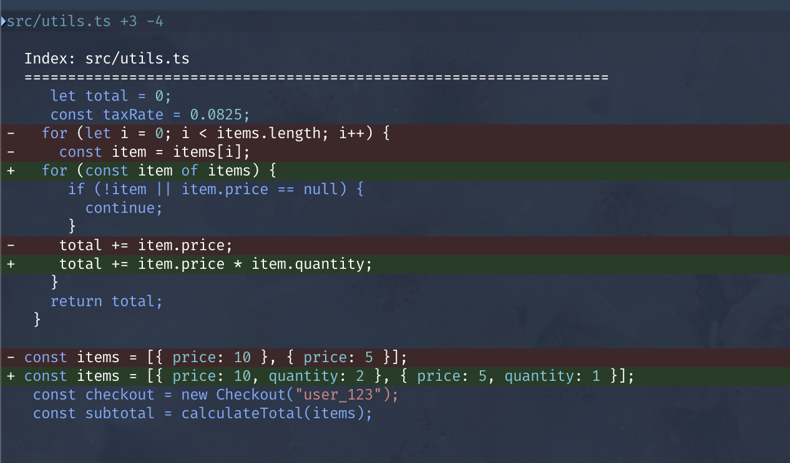

# @unblessed/perf

Performance instrumentation tools for the @unblessed render pipeline.

This package provides a lightweight FPS and frame timing collector that hooks into
`@unblessed/core` with near-zero overhead when disabled. It is designed to keep
profiling logic out of core while still exposing high-quality metrics for debugging
and regression analysis.

## Showcase

Use these examples to validate perf instrumentation against real widget output.




For a broader visual gallery, see `packages/contrib/README.md`.

## Install

```bash
pnpm add -D @unblessed/perf
```

## Usage

```ts
import { Screen } from "@unblessed/node";
import {
  createPerfOverlay,
  installRenderPerfObserver,
  removeRenderObserver,
} from "@unblessed/perf";

const screen = new Screen({ smartCSR: true });
const perf = installRenderPerfObserver({ targetFps: 60 });
createPerfOverlay(screen, perf);

screen.render();

console.log(perf.getStats());

// Disable collection
removeRenderObserver();
```

## What It Measures

- **Frame time**: duration from `Screen.render()` start to end.
- **FPS average**: derived from average frame time.
- **Percentiles**: p50/p95/p99 of recent frame times (rolling buffer).
- **Dropped frames**: count where frame time exceeds target FPS budget.
- **Bytes written**: total bytes flushed through `Program._owrite()` while a frame is active.

## Recommended Workflow

1. Install the observer in your app entry.
2. Use the overlay while developing or profiling.
3. Capture stats before/after renderer changes.
4. Use `@unblessed/vrt` to ensure visual output does not regress.

## API

### installRenderPerfObserver(options?)

Registers a render observer in core and returns the observer instance.

**Options:**

- `maxSamples` (default: 300)
- `targetFps` (default: 60)

### RenderPerfObserver

Methods:

- `getStats()` - Returns render stats (avg, percentiles, dropped frames, bytes written)
- `reset()` - Resets counters and samples

### RenderPerfStats

```ts
interface RenderPerfStats {
  count: number;
  renderAvgMs: number;
  outputAvgMs: number;
  avgMs: number;
  minMs: number;
  maxMs: number;
  p50Ms: number;
  p95Ms: number;
  p99Ms: number;
  fpsAvg: number;
  dropped: number;
  bytesWritten: number;
  bytesPerFrame: number;
  bytesPerSec: number;
  flushCount: number;
  flushAvg: number;
}
```

### removeRenderObserver()

Unregisters the current render observer (disables metrics collection).

### createPerfOverlay(screen, observer, options?)

Creates a small overlay box that displays live stats and refreshes on an interval.

**Options:**

- `refreshMs` (default: 250)
- `label` (default: "perf")
- `top` (default: 0)
- `right` (default: 0)
- `width` (default: 18)

**Returns:**

- `box`: the overlay widget (for styling or positioning)
- `stop()`: cleanly stops the overlay and destroys its box

## Example: Overlay + Animation

```ts
import { Box, Screen } from "@unblessed/node";
import { createPerfOverlay, installRenderPerfObserver } from "@unblessed/perf";

const screen = new Screen({ smartCSR: true });
const perf = installRenderPerfObserver({ targetFps: 60 });
createPerfOverlay(screen, perf, { label: "render" });

const box = new Box({
  parent: screen,
  top: "center",
  left: "center",
  width: 30,
  height: 5,
  border: { type: "line" },
  content: "Animating",
});

let frame = 0;
setInterval(() => {
  frame += 1;
  box.setContent(`frame ${frame}`);
  screen.renderThrottled();
}, 50);

screen.render();
```

## Design Notes

- The observer is registered through a minimal hook in core. When no observer
  is installed, the runtime overhead is a single null check.
- The collector is intended for profiling and regression checks, not production
  telemetry. Keep it opt-in.

## Troubleshooting

- **FPS is always 0**: Ensure you called `installRenderPerfObserver()` before renders.
- **Bytes written stays 0**: The overlay only counts bytes during an active frame.
- **Overlay flickers**: Increase `refreshMs` or use `screen.renderThrottled()`.

## Notes

- This package measures render timing via core hooks; it does not use screenshots.
- Visual regression testing is handled separately by `@unblessed/vrt`.
