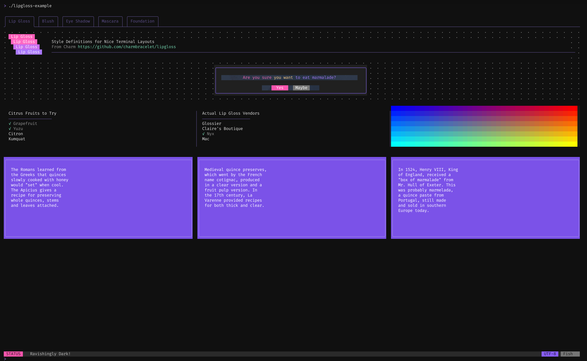
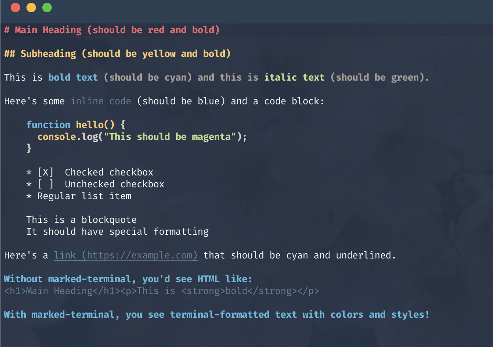

# @unblessed/theme

Theme tokens and utility classes for unblessed widgets.

This package provides a token-based theme system with an optional
Tailwind-like utility parser. Utilities are built on top of tokens, so
you can use either style or both together.

## Showcase

Theme tokens and utility classes driving a styled terminal layout:



Related themed widgets in contrib:



## Install

```bash
pnpm add @unblessed/theme
```

## Token-only usage

```ts
import { createTheme } from "@unblessed/theme";

const theme = createTheme({
  colors: {
    bg: "#121212",
    accent: "#8a63ff",
    text: "#e0e0e0",
  },
  spacing: { sm: 1, md: 2, lg: 3 },
  components: {
    tabs: {
      base: { style: { fg: "text", bg: "bg" } },
      variants: {
        active: { style: { fg: "bg", bg: "accent", bold: true } },
      },
    },
  },
});

const base = theme.component("tabs");
const active = theme.component("tabs", "active");
```

## Utility-class usage

```ts
import { createTheme } from "@unblessed/theme";

const theme = createTheme({
  colors: { bg: "#121212", accent: "#8a63ff", text: "#e0e0e0" },
  spacing: { sm: 1, md: 2, lg: 3 },
});

const styles = theme.utils.parseClasses("bg-bg fg-text px-md py-sm bold");
// => { style: { bg: "#121212", fg: "#e0e0e0", bold: true }, padding: { ... } }
```

## Variants (hover, focus, active)

Variants are supported by prefixing utilities. Widgets are responsible for
tracking state and choosing which variant bundle to apply.

```ts
// Pseudo example of variant classes
const base = "bg-bg fg-text px-md";
const hover = "hover:bg-accent";
const active = "active:bg-accent active:fg-bg";
```

## React renderer note

`@unblessed/react` has its own theming abstractions. This package targets core
and contrib widgets. It is not redundant; it provides a framework-agnostic theme
layer that React can optionally map to if desired.

## Notes

- Tokens are the single source of truth.
- Utility classes are syntactic sugar on top of tokens.
- The package is framework-agnostic and does not depend on core widgets.
